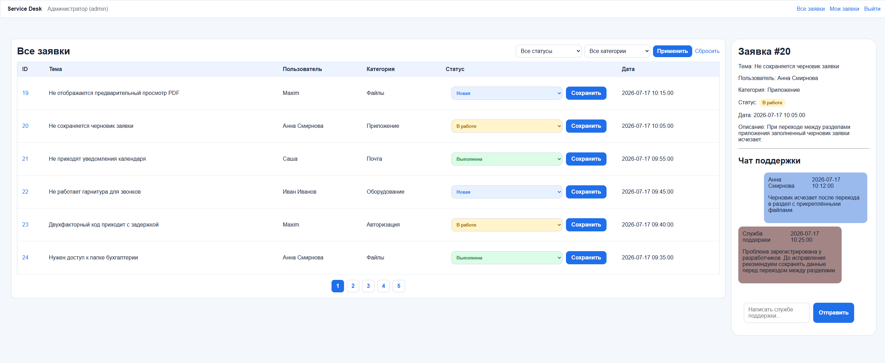
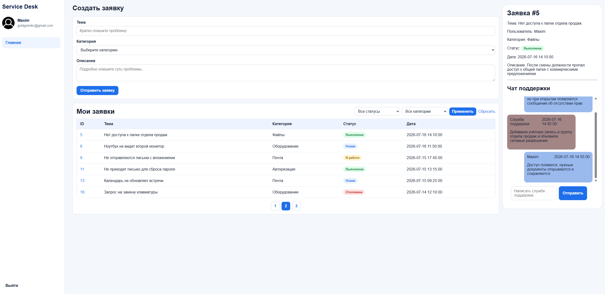
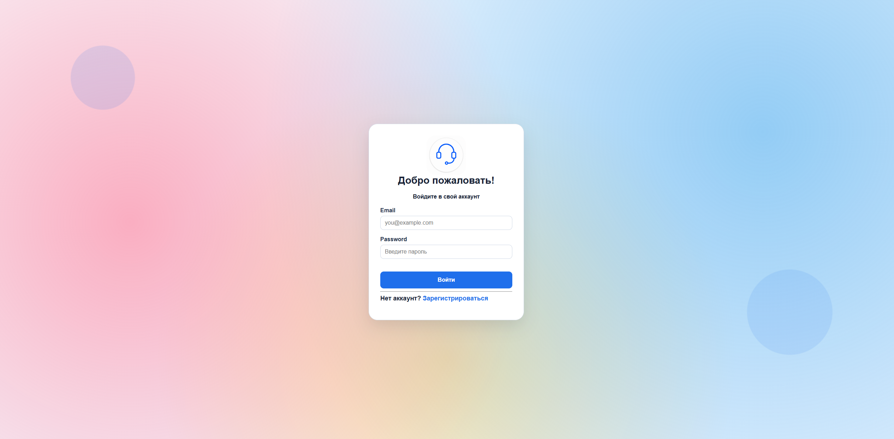
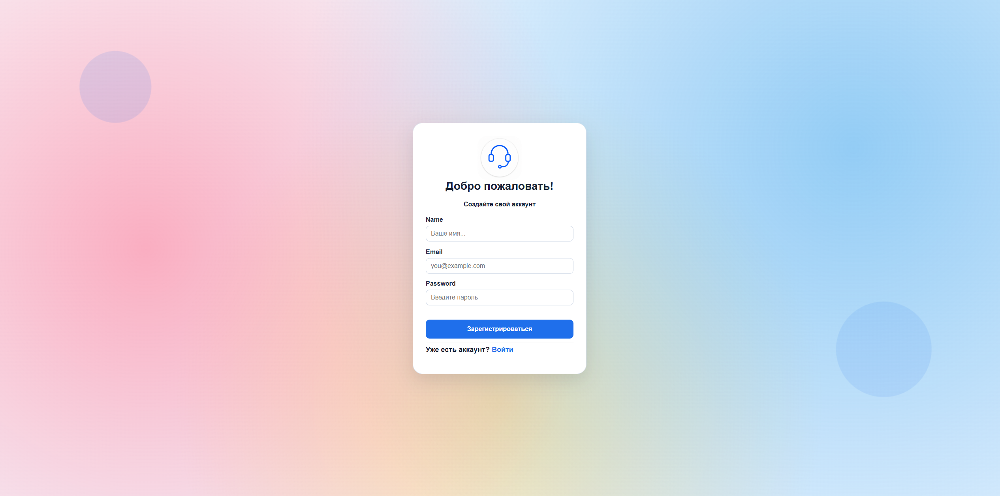

# Service Desk

Service Desk is a web application for creating, managing, and discussing support tickets.

The project was built with plain PHP and MySQL as an internship and learning project. It demonstrates authentication, role-based access, database relationships, filtering, pagination, and secure database queries with PDO.
## img
<p>Admin page</p>
<p>User page</p>
<p>Login page</p>
<p>Registration page</p>

## Features

### User

- Registration, login, and logout
- Create support tickets
- Select ticket categories loaded from the database
- View only personal tickets
- Filter tickets by category and status
- Browse tickets with pagination
- Open a detailed ticket preview
- Send messages to the support team
- View ticket status with visual color indicators

### Administrator

- View tickets from all users
- Filter tickets by category and status
- Browse tickets with pagination
- Open detailed ticket information
- Change ticket status
- Reply to users in the support chat

## Ticket Statuses

The application supports the following statuses:

- `new` — New
- `in_progress` — In Progress
- `done` — Completed
- `rejected` — Rejected

## Technologies

- PHP 8
- MySQL
- PDO
- HTML5
- CSS3
- PHP Sessions

## Security

The project currently includes:

- Password hashing with `password_hash()`
- Password verification with `password_verify()`
- Prepared statements for database queries
- Role-based access control
- Ticket ownership verification
- Output escaping with `htmlspecialchars()`
- Validation of ticket IDs, categories, statuses, and form fields

## Project Structure

```text
service-desk/
├── config/
│   └── database.php
├── database/
│   └── schema.sql
├── public/
│   ├── css/
│   │   └── style.css
│   ├── img/
│   ├── index.php
│   ├── login.php
│   ├── logout.php
│   ├── my-tickets.php
│   └── registration.php
└── README.md